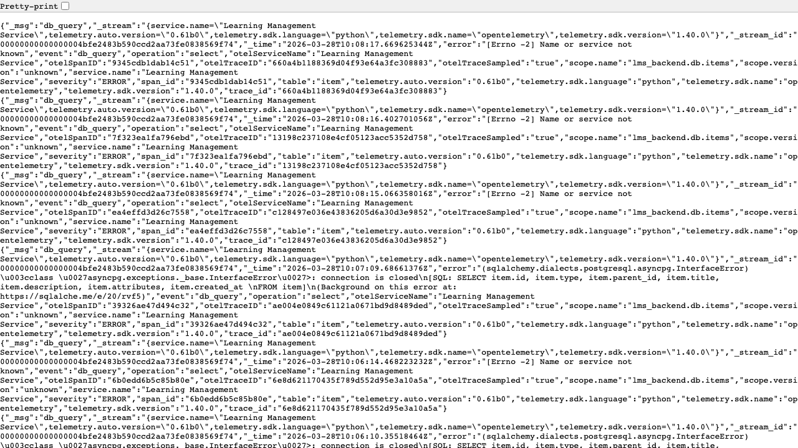
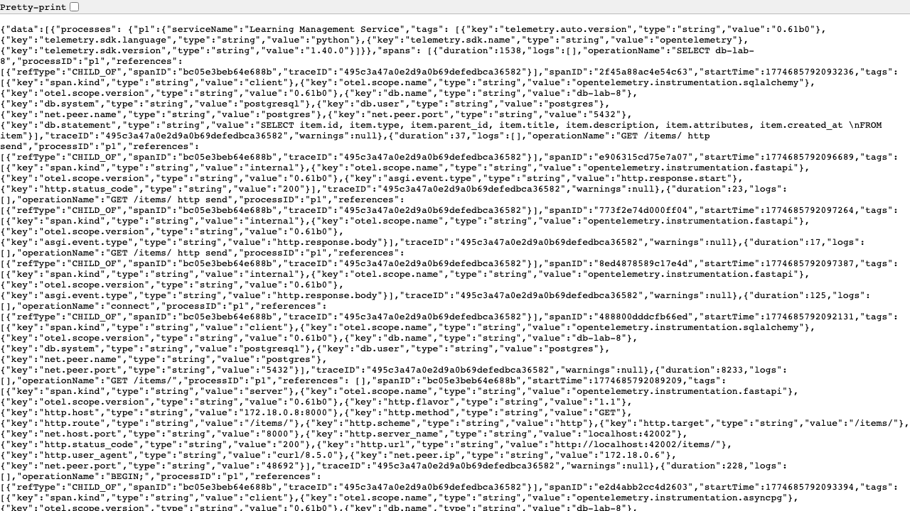
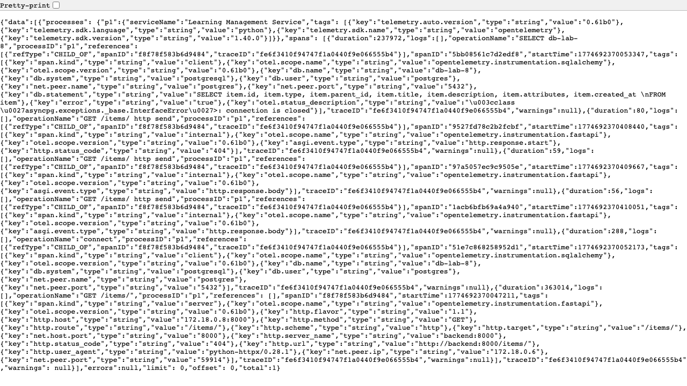

# Lab 8 — Report

Paste your checkpoint evidence below. Add screenshots as image files in the repo and reference them with ``.

## Task 1A — Bare agent

### Prompt: What is the agentic loop?

The agentic loop is the fundamental cycle that an autonomous AI agent follows to accomplish tasks. It's the core reasoning and action pattern that enables agents to work independently toward goals.

The Basic Loop (Perceive -> Think -> Act)

The classic agentic loop consists of three main stages:

1. Perceive/Observation - The agent gathers information about its environment or current state (reading files, checking outputs, receiving user input, etc.)
2. Think/Reasoning - The agent processes the information, plans next steps, makes decisions, and determines what action to take
3. Act/Execution - The agent performs an action (calling a tool, writing a file, executing a command, sending a message)

After acting, the loop repeats: the agent observes the result of its action, reasons about what to do next, and acts again, continuing until the goal is achieved.

### Prompt: What labs are available in our LMS?

Based on exploration of the local LMS workspace, the agent returned:

- Required tasks: `task-1.md`, `task-2.md`, `task-3.md`, `task-4.md`, `task-5.md`
- Optional tasks: `task-1.md`

At this stage the answer came from local files/docs inspection, not from live LMS backend tools (MCP was not connected yet).

## Task 1B — Agent with LMS tools

### Prompt: What labs are available?

MCP connection and tool registration log excerpt:

- `MCP server 'lms': connected, 9 tools registered`
- `Tool call: mcp_lms_lms_labs({})`

Agent response (live backend data):

- Lab 01 – Products, Architecture & Roles
- Lab 02 — Run, Fix, and Deploy a Backend Service
- Lab 03 — Backend API: Explore, Debug, Implement, Deploy
- Lab 04 — Testing, Front-end, and AI Agents
- Lab 05 — Data Pipeline and Analytics Dashboard
- Lab 06 — Build Your Own Agent
- Lab 07 — Build a Client with an AI Coding Agent
- lab-08

### Prompt: Describe the architecture of the LMS system

Agent response summary:

- Gateway layer: Caddy as reverse proxy and single entrypoint
- Application layer: FastAPI backend, Nanobot agent, Qwen Code API
- Data layer: PostgreSQL + pgAdmin
- Frontend layer: React dashboard (and optional Flutter chat integration)
- Observability: OpenTelemetry Collector + VictoriaLogs + VictoriaTraces
- Cross-cutting concerns: API key auth, Docker network/service discovery, infra via docker-compose

## Task 1C — Skill prompt

### Prompt: Show me the scores

MCP + skill behavior log excerpt:

- `MCP server 'lms': connected, 9 tools registered`
- `Tool call: mcp_lms_lms_labs({})`

Agent response:

"There are 8 labs available. Which lab would you like to see the scores for?"

Then it listed lab choices (Lab 01 ... Lab 07, lab-08) and asked for a specific
lab before running lab-specific score tools. This confirms the LMS skill strategy
for missing lab parameter is working.

## Task 2A — Deployed agent

Docker startup excerpt (`docker compose --env-file .env.docker.secret logs nanobot --tail 50`):

- `Using config: /app/nanobot/config.resolved.json`
- `Starting nanobot gateway version 0.1.4.post5 on port 18790`
- `WebChat channel enabled`
- `Channels enabled: webchat`
- `MCP server 'lms': connected, 9 tools registered`
- `MCP server 'webchat': connected, 1 tools registered`
- `Agent loop started`

## Task 2B — Web client

Web client and WebSocket evidence:

- `curl http://localhost:42002/flutter` returns `200` and serves Flutter index (`<base href="/flutter/">`).
- WebSocket via Caddy `/ws/chat` with access key returned real data.

Transcript sample:

Prompt: `How is the backend doing?`

Response:

- `The backend is healthy`
- `Status: healthy`
- `Item count: 56 items`

Prompt: `Show me the scores`

Responses included a structured choice payload (`type: "choice"`) with lab options:

- `Lab 01 – Products, Architecture & Roles` (`value: "lab-01"`)
- `Lab 02 — Run, Fix, and Deploy a Backend Service` (`value: "lab-02"`)
- ...
- `lab-08` (`value: "lab-08"`)

This confirms `mcp_webchat_ui_message` is wired and the client can render structured lab selection instead of raw JSON text.

## Task 3A — Structured logging

Happy-path excerpt (`request_started -> request_completed`, status 200):

```text
2026-03-28 08:16:32,089 INFO [lms_backend.main] ... [trace_id=495c3a47a0e2d9a0b69defedbca36582 ...] - request_started
2026-03-28 08:16:32,090 INFO [lms_backend.auth] ... [trace_id=495c3a47a0e2d9a0b69defedbca36582 ...] - auth_success
2026-03-28 08:16:32,091 INFO [lms_backend.db.items] ... [trace_id=495c3a47a0e2d9a0b69defedbca36582 ...] - db_query
2026-03-28 08:16:32,096 INFO [lms_backend.main] ... [trace_id=495c3a47a0e2d9a0b69defedbca36582 ...] - request_completed
INFO: ... "GET /items/ HTTP/1.1" 200 OK
```

Error-path excerpt (PostgreSQL stopped; `db_query` error):

```text
2026-03-28 10:06:10,047 INFO  [lms_backend.main] ... [trace_id=fe6f3410f94747f1a0440f9e066555b4 ...] - request_started
2026-03-28 10:06:10,049 INFO  [lms_backend.auth] ... [trace_id=fe6f3410f94747f1a0440f9e066555b4 ...] - auth_success
2026-03-28 10:06:10,050 INFO  [lms_backend.db.items] ... [trace_id=fe6f3410f94747f1a0440f9e066555b4 ...] - db_query
2026-03-28 10:06:10,355 ERROR [lms_backend.db.items] ... [trace_id=fe6f3410f94747f1a0440f9e066555b4 ...] - db_query
2026-03-28 10:06:10,407 INFO  [lms_backend.main] ... [trace_id=fe6f3410f94747f1a0440f9e066555b4 ...] - request_completed
INFO: ... "GET /items/ HTTP/1.1" 404
```

VictoriaLogs query used:

```text
_time:10m service.name:"Learning Management Service" severity:ERROR
```

API check equivalent returned recent LMS ERROR records with trace IDs used below.



## Task 3B — Traces

Healthy trace (`trace_id=495c3a47a0e2d9a0b69defedbca36582`) from VictoriaTraces:

- spans: 8
- services: `Learning Management Service`
- key operations: `GET /items/`, `SELECT db-lab-8`, `BEGIN;`, `ROLLBACK;`

Error trace (`trace_id=fe6f3410f94747f1a0440f9e066555b4`) from VictoriaTraces:

- spans: 6
- services: `Learning Management Service`
- key operations: `GET /items/`, `SELECT db-lab-8`
- same request path, but with error surfaced in DB query logs for this trace

Trace API endpoints used:

- `/select/jaeger/api/traces/495c3a47a0e2d9a0b69defedbca36582`
- `/select/jaeger/api/traces/fe6f3410f94747f1a0440f9e066555b4`




## Task 3C — Observability MCP tools

MCP tools registered in nanobot logs:

- `mcp_obs_logs_search`
- `mcp_obs_logs_error_count`
- `mcp_obs_traces_list`
- `mcp_obs_traces_get`

Normal condition prompt:

`Any LMS backend errors in the last 10 minutes?`

Agent response:

`No errors found in the LMS backend over the last 10 minutes. The error count query returned 0 ERROR-level log records for the Learning Management Service during this window.`

Failure condition scenario:

1. `docker compose --env-file .env.docker.secret stop postgres`
2. Triggered LMS requests (`GET /items/` returned 404 while DB was down)
3. Prompted again: `Any LMS backend errors in the last 10 minutes?`

Agent response (excerpt):

`Yes, there are LMS backend errors in the last 10 minutes.`

- `5 errors detected in the last 10 minutes from the Learning Management Service`
- `Root cause: Database connectivity issues`
- reported recent failing trace and ongoing status

Then PostgreSQL was restarted:

`docker compose --env-file .env.docker.secret start postgres`

## Task 4A — Multi-step investigation

With PostgreSQL stopped, prompt:

`What went wrong?`

Agent response (chained log + trace investigation):

```text
Root Cause: Database Connection Failure

Log Evidence:
- db_query ERROR at 10:17:42 UTC — [Errno -2] Name or service not known
  when executing SELECT on the item table

Trace Evidence:
- Trace 63ca3c8395269b00617a677cddfb6f4a
- Failing operation: GET /items/ (error tag set)
- connect span failed while attempting PostgreSQL connection via asyncpg

Summary:
The LMS backend cannot connect to PostgreSQL because the database hostname is
unresolvable (socket.gaierror). This breaks lab listing requests.
```

## Task 4B — Proactive health check

In the same chat, prompt:

`Create a health check for this chat that runs every 2 minutes using your cron tool...`

Then:

`List scheduled jobs.`

Observed transcript (cron + proactive report):

```text
Health check scheduled successfully.
- Job ID: 1f88b603
- Interval: Every 2 minutes

Scheduled Jobs:
| LMS health check ... | 1f88b603 | Every 2 minutes | ... |

... (PostgreSQL still stopped, fresh failing request triggered) ...

🚨 LMS Health Check (last 2 min)
Status: UNHEALTHY
Errors found: 4 ERROR-level events in Learning Management Service
Root cause: Database connection failure (Name or service not known)
Trace evidence: 11284327fda6bb825a094271e83dde2b, failing connect span
```

Then test job was removed:

`Remove the short-interval test job.`

Result:

`Job removed successfully (1f88b603).`

## Task 4C — Bug fix and recovery

1. Root cause identified

- Planted bug was in backend failure-handling path for `GET /items/`:
  broad exception catch in `backend/src/lms_backend/routers/items.py`
  translated real DB failures into misleading `404 Items not found`.

2. Code fix

- Removed the broad catch/wrap block so DB failures are no longer masked as 404.
- File changed: `backend/src/lms_backend/routers/items.py`

Diff:

```diff
 @router.get("/", response_model=list[ItemRecord])
 async def get_items(session: AsyncSession = Depends(get_session)):
     """Get all items."""
-    try:
-        return await read_items(session)
-    except Exception as exc:
-        logger.warning(
-            "items_list_failed_as_not_found",
-            extra={"event": "items_list_failed_as_not_found"},
-        )
-        raise HTTPException(
-            status_code=status.HTTP_404_NOT_FOUND,
-            detail="Items not found",
-        ) from exc
+    return await read_items(session)
```

3. Post-fix response to `What went wrong?` (after redeploy, PostgreSQL stopped)

```text
Root Cause: Database connectivity failure

Log Evidence:
ERROR db_query at 10:23:10 — [Errno -2] Name or service not known

Trace Evidence:
Trace 186b1cc1351454783797a0ea888d07a2
GET /items/ failed during connect span

Summary:
Backend cannot resolve PostgreSQL hostname; requests fail with HTTP 500.
```

This confirms the real underlying DB failure is surfaced (no fake `404 Items not found` mapping).

4. Healthy follow-up report after recovery

After PostgreSQL restart, created a fresh 2-minute health check in chat and
waited for next cycle. Proactive report:

```text
Health Check Result ✅
- Window: Last 2 minutes
- LMS Errors: 0
- Status: Healthy
No errors detected in the Learning Management Service.
```

Then updated interval:

`Change that health check to every 15 minutes.`

Resulting active job:

`af62acc9`, every 15 minutes.
